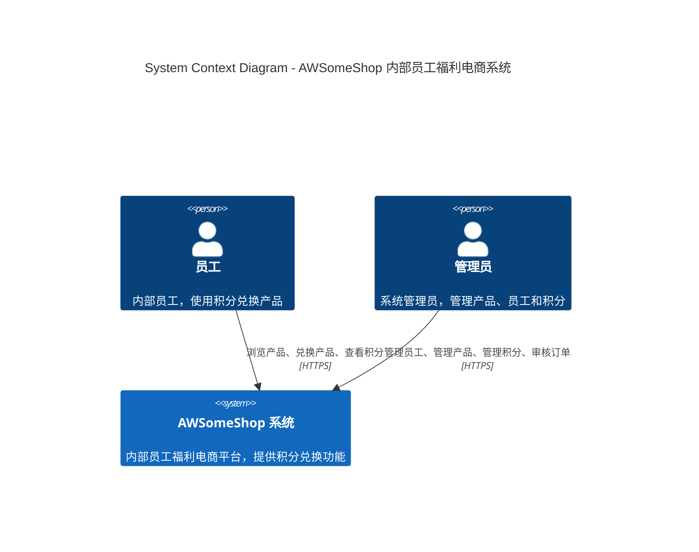
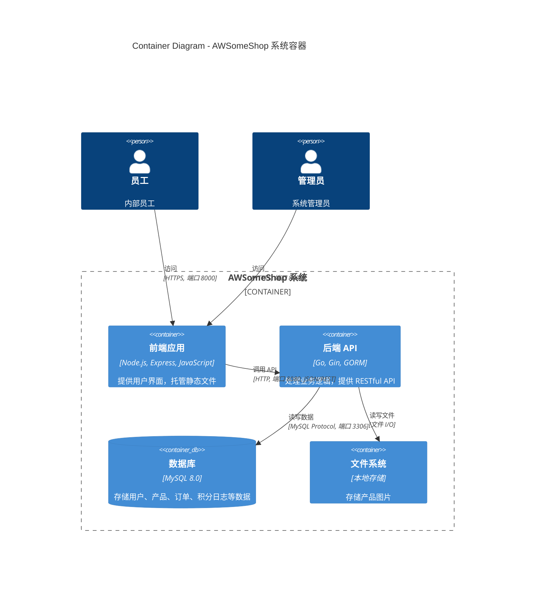
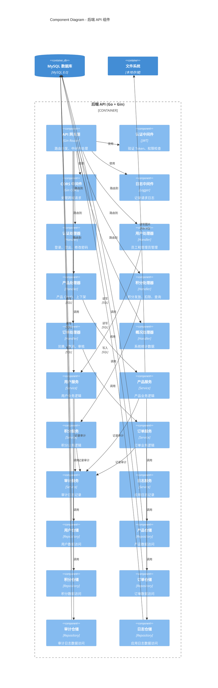
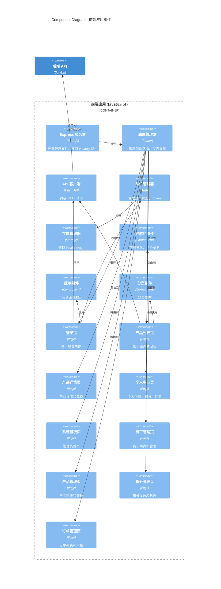
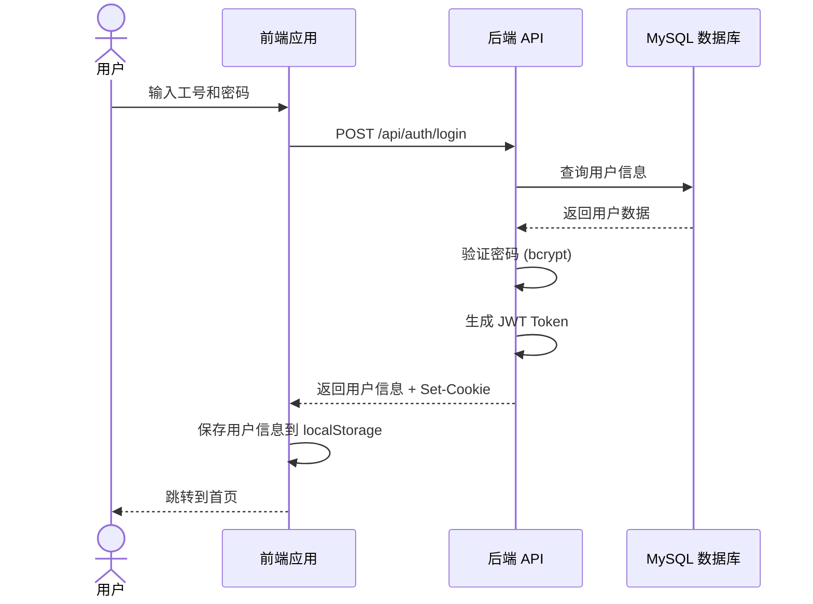
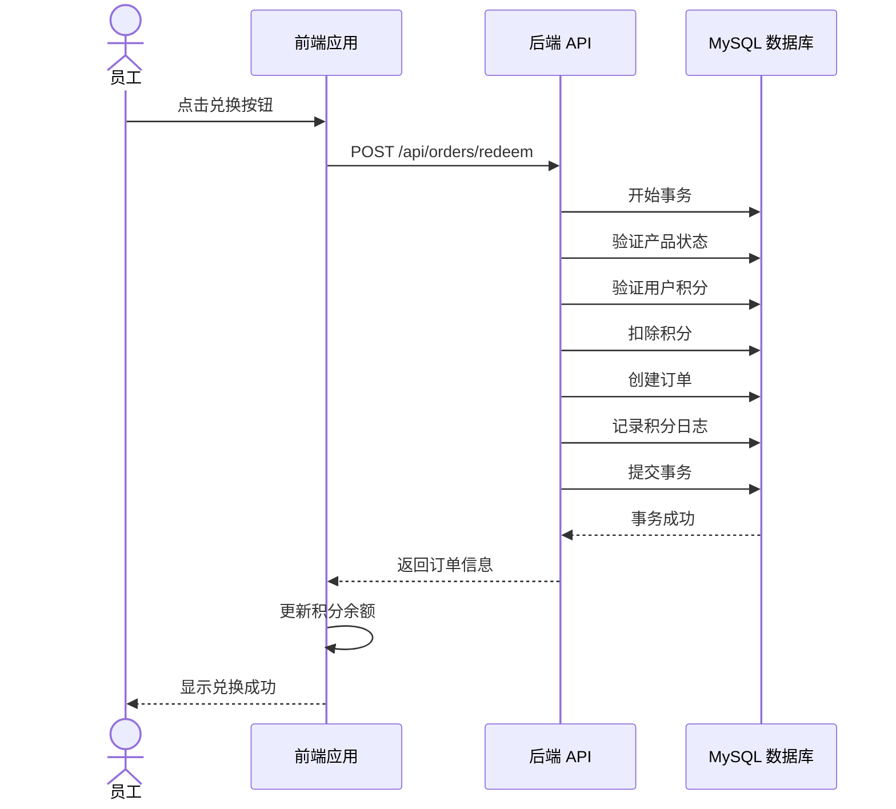
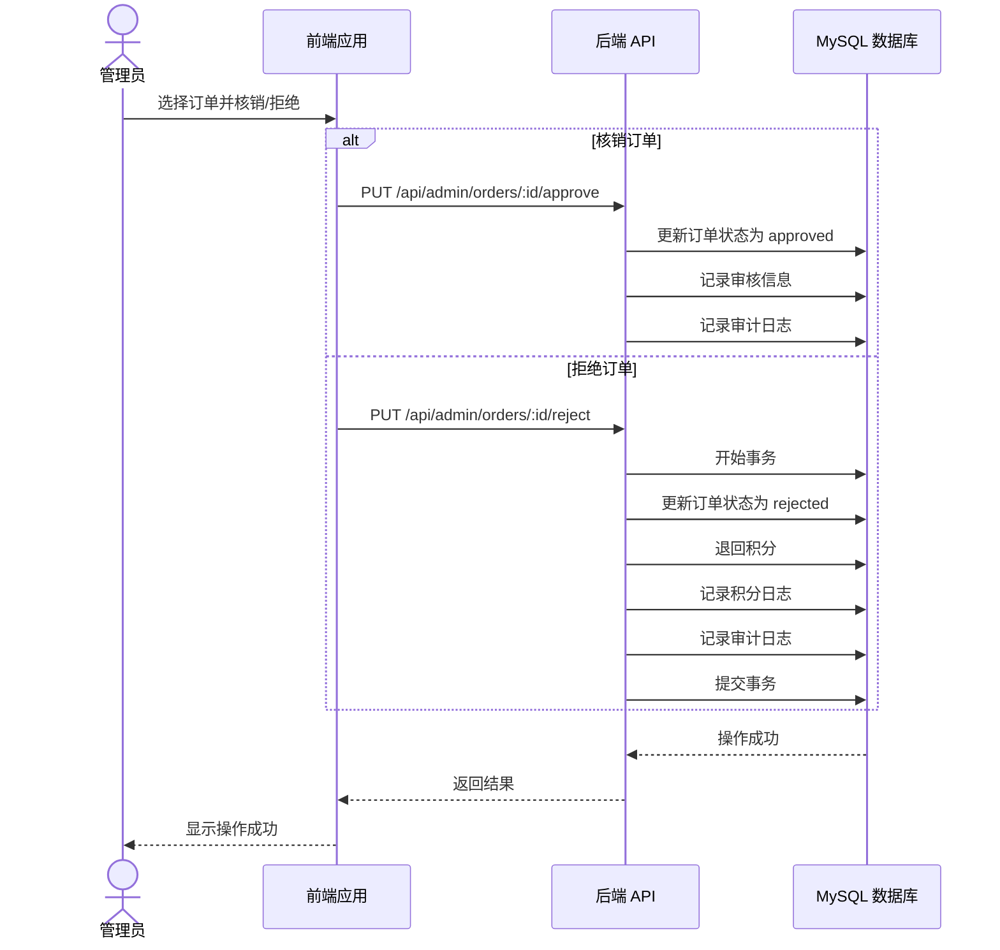
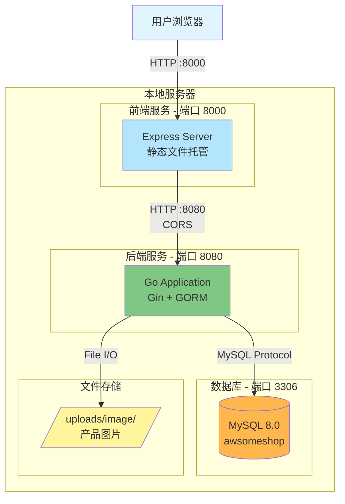
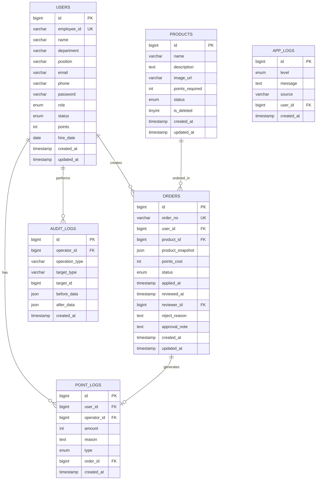
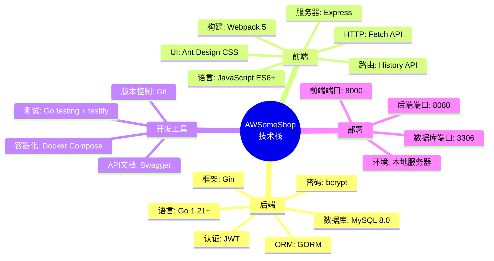

# AWSomeShop 系统架构图（C4 Model）

## 文档信息

- **项目名称**: AWSomeShop 内部员工福利电商系统
- **文档版本**: 1.0
- **创建日期**: 2026-01-14
- **架构模型**: C4 Model
- **图表工具**: Mermaid

---

## Level 1: System Context Diagram（系统上下文图）

系统上下文图展示了 AWSomeShop 系统与外部用户和系统的关系。

**说明**:
- **员工**: 使用系统浏览产品、兑换产品、查看积分余额和兑换历史
- **管理员**: 管理系统的所有资源（员工、产品、积分、订单）
- **AWSomeShop 系统**: 核心业务系统，处理所有业务逻辑

---

## Level 2: Container Diagram（容器图）

容器图展示了系统内部的高层技术构建块（应用程序、数据存储等）。

**说明**:
- **前端应用**: Express 服务器托管 Webpack 打包的静态文件（HTML/CSS/JS）
- **后端 API**: Go + Gin 框架，提供 RESTful API，处理所有业务逻辑
- **数据库**: MySQL 存储所有业务数据
- **文件系统**: 本地存储产品图片（/uploads/image/）

---

## Level 3: Component Diagram - 后端 API（组件图）

组件图展示了后端 API 容器内部的组件结构。

**组件说明**:

### API 网关层
- **API 网关**: Gin Router，负责路由分发和中间件处理

### 中间件层
- **认证中间件**: JWT Token 验证和权限检查
- **CORS 中间件**: 处理跨域请求
- **日志中间件**: 记录所有 API 请求

### 处理器层（Handler）
- **认证处理器**: 处理登录、登出、修改密码
- **用户处理器**: 处理员工和管理员的 CRUD 操作
- **产品处理器**: 处理产品的 CRUD、上下架操作
- **积分处理器**: 处理积分发放、扣除、查询
- **订单处理器**: 处理产品兑换、订单取消、订单审核
- **概况处理器**: 提供系统统计数据

### 服务层（Service）
- **用户服务**: 用户相关业务逻辑（工号生成、密码哈希等）
- **产品服务**: 产品相关业务逻辑（图片上传、软删除等）
- **积分服务**: 积分相关业务逻辑（批量发放、日志记录等）
- **订单服务**: 订单相关业务逻辑（订单号生成、事务处理等）
- **审计服务**: 记录所有管理员操作
- **日志服务**: 记录应用运行日志

### 仓储层（Repository）
- **用户仓储**: 用户数据的 CRUD 操作
- **产品仓储**: 产品数据的 CRUD 操作
- **积分仓储**: 积分和积分日志的 CRUD 操作
- **订单仓储**: 订单数据的 CRUD 操作
- **审计仓储**: 审计日志的写入操作
- **日志仓储**: 应用日志的写入操作

---

## Level 3: Component Diagram - 前端应用（组件图）

**组件说明**:

### 服务器层
- **Express 服务器**: 托管静态文件，支持 History 路由

### 核心模块
- **路由管理器**: 管理前端路由，实现 SPA 导航
- **API 客户端**: 封装所有 HTTP 请求，统一错误处理
- **认证管理器**: 管理用户登录状态，处理 JWT Token
- **存储管理器**: 管理 localStorage 数据

### 公共组件
- **导航栏组件**: 顶部导航菜单、用户信息显示
- **提示组件**: Toast 消息提示
- **分页组件**: 列表分页控件

### 员工端页面
- **登录页**: 员工和管理员登录
- **产品列表页**: 浏览所有产品
- **产品详情页**: 查看产品详情、兑换产品
- **个人中心页**: 个人信息、积分余额、兑换历史

### 管理员端页面
- **系统概况页**: 系统统计数据
- **员工管理页**: 员工列表、创建、编辑
- **产品管理页**: 产品列表、创建、编辑、上下架
- **积分管理页**: 积分发放、扣除、日志查询
- **订单管理页**: 订单列表、核销、拒绝

---

## 数据流图

### 用户登录流程

### 产品兑换流程

### 订单审核流程

---

## 部署架构图

---

## 数据库 ER 图

---

## 技术栈总览

---

## 架构特点

### 优点
1. **前后端分离**: 职责清晰，便于独立开发和部署
2. **RESTful API**: 标准化接口，易于理解和维护
3. **分层架构**: Handler → Service → Repository，职责明确
4. **事务支持**: 关键操作使用数据库事务保证数据一致性
5. **审计日志**: 完整记录管理员操作，便于追溯
6. **JWT 认证**: 无状态认证，易于扩展

### 限制
1. **无缓存**: MVP 版本未使用缓存，性能可能受限
2. **无并发控制**: 未处理并发场景，可能出现数据不一致
3. **单数据库**: 所有服务共享一个数据库，耦合度较高
4. **本地存储**: 图片存储在本地文件系统，不支持分布式

### 扩展性
1. **添加缓存**: 可引入 Redis 缓存热点数据
2. **数据库分离**: 可为不同模块使用独立数据库
3. **消息队列**: 可引入消息队列处理异步任务
4. **对象存储**: 可将图片迁移到对象存储服务
5. **负载均衡**: 可部署多个后端实例，使用负载均衡

---

**文档结束**
