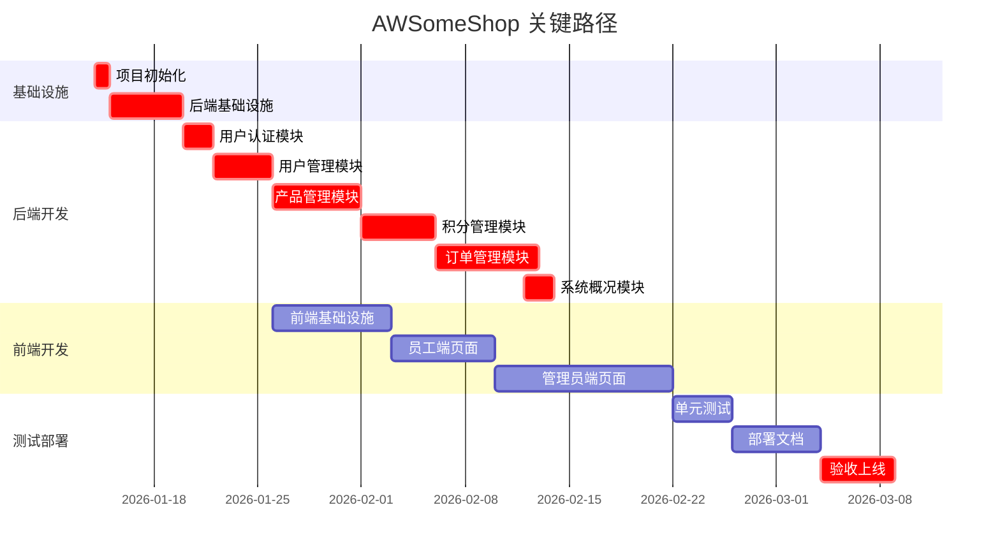
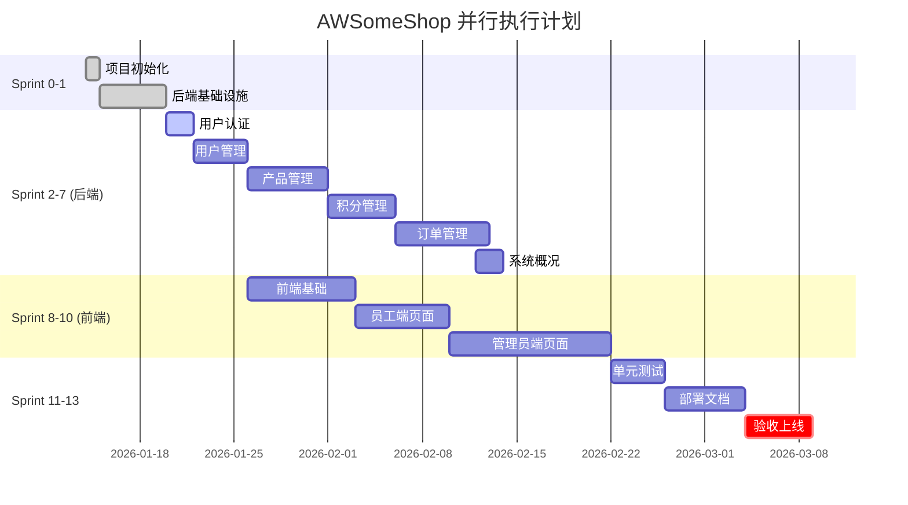

# AWSomeShop 并行任务执行计划

## 文档信息

- **项目名称**: AWSomeShop 内部员工福利电商系统
- **文档版本**: 2.0（并行优化版）
- **创建日期**: 2026-01-14
- **文档状态**: 待审批
- **优化目标**: 通过并行执行减少项目交付时间

---

## 1. 执行策略

### 1.1 并行执行原则

1. **无依赖任务可并行**: 没有依赖关系的任务可以同时执行
2. **同层级任务可并行**: 相同模块的不同功能可以并行开发
3. **前后端可并行**: 在 API 接口定义明确后，前后端可以并行开发
4. **测试可并行**: 不同模块的测试可以并行执行

### 1.2 团队配置建议

- **后端开发**: 2-3 人
- **前端开发**: 2 人
- **测试**: 1 人（可兼职）
- **DevOps**: 1 人（可兼职）

---

## 2. 并行任务组划分

### 📦 Sprint 0: 项目初始化（3 天）

**目标**: 搭建项目基础框架

#### 任务组 0.1 - 项目搭建（可并行）⚡
- **TASK-001**: 创建项目结构 [1天] 👤 DevOps
- **TASK-002**: 配置开发环境 [1天] 👤 后端 + 前端
- **TASK-003**: 设置数据库 [1天] 👤 后端

**并行度**: 3 任务可同时进行  
**实际耗时**: 1 天（最长任务）

---

### 📦 Sprint 1: 后端基础设施（5 天）

**目标**: 完成后端基础框架和中间件

#### 任务组 1.1 - 核心基础（串行）
- **TASK-004**: 数据库连接和配置管理 [1天] 👤 后端-1

#### 任务组 1.2 - 基础模块（可并行）⚡
- **TASK-005**: 统一响应格式和错误处理 [1天] 👤 后端-1
- **TASK-006**: 日志模块 [2天] 👤 后端-2
- **TASK-008**: CORS 中间件 [0.5天] 👤 后端-3

**并行度**: 3 任务可同时进行  
**实际耗时**: 2 天（最长任务）

#### 任务组 1.3 - 认证中间件（串行）
- **TASK-007**: JWT 认证中间件 [2天] 👤 后端-1

**Sprint 1 总耗时**: 1 + 2 + 2 = 5 天

---

### 📦 Sprint 2: 用户认证模块（2 天）

**目标**: 完成用户登录登出功能

#### 任务组 2.1 - 认证功能（可并行）⚡
- **TASK-009**: 用户登录 API [2天] 👤 后端-1
- **TASK-010**: 用户登出 API [0.5天] 👤 后端-2
- **TASK-011**: 修改密码 API [1天] 👤 后端-3

**并行度**: 3 任务可同时进行  
**实际耗时**: 2 天（最长任务）

---

### 📦 Sprint 3: 用户管理模块（6 天）

**目标**: 完成员工和管理员管理功能

#### 任务组 3.1 - 工号生成（串行）
- **TASK-012**: 工号生成算法 [1天] 👤 后端-1

#### 任务组 3.2 - 用户 CRUD（可并行）⚡
- **TASK-013**: 创建员工 API [2天] 👤 后端-1
- **TASK-018**: 创建管理员 API [1天] 👤 后端-2

**并行度**: 2 任务可同时进行  
**实际耗时**: 2 天（最长任务）

#### 任务组 3.3 - 用户查询和更新（可并行）⚡
- **TASK-014**: 员工列表查询 API [1天] 👤 后端-1
- **TASK-015**: 员工详情查询 API [0.5天] 👤 后端-2
- **TASK-016**: 更新员工信息 API [1天] 👤 后端-3
- **TASK-017**: 重置员工密码 API [1天] 👤 后端-2

**并行度**: 4 任务可同时进行  
**实际耗时**: 1 天（最长任务）

**Sprint 3 总耗时**: 1 + 2 + 1 = 4 天

---

### 📦 Sprint 4: 产品管理模块（7 天）

**目标**: 完成产品管理功能

#### 任务组 4.1 - 文件上传（串行）
- **TASK-019**: 图片上传功能 [2天] 👤 后端-1
- **TASK-020**: 图片访问 API [1天] 👤 后端-1

**实际耗时**: 3 天

#### 任务组 4.2 - 产品 CRUD（可并行）⚡
- **TASK-021**: 创建产品 API [2天] 👤 后端-1
- **TASK-025**: 更新产品 API [2天] 👤 后端-2
- **TASK-026**: 删除产品 API [1天] 👤 后端-3
- **TASK-027**: 产品上架/下架 API [1天] 👤 后端-3

**并行度**: 4 任务可同时进行  
**实际耗时**: 2 天（最长任务）

#### 任务组 4.3 - 产品查询（可并行）⚡
- **TASK-022**: 产品列表查询 API（管理员）[1天] 👤 后端-1
- **TASK-023**: 产品列表查询 API（员工）[1天] 👤 后端-2
- **TASK-024**: 产品详情查询 API [0.5天] 👤 后端-3

**并行度**: 3 任务可同时进行  
**实际耗时**: 1 天（最长任务）

**Sprint 4 总耗时**: 3 + 2 + 1 = 6 天

---

### 📦 Sprint 5: 积分管理模块（5 天）

**目标**: 完成积分管理功能

#### 任务组 5.1 - 积分查询（可并行）⚡
- **TASK-028**: 积分余额查询 API（员工）[0.5天] 👤 后端-1
- **TASK-029**: 积分日志查询 API（员工）[1天] 👤 后端-2
- **TASK-030**: 积分日志查询 API（管理员）[1天] 👤 后端-3

**并行度**: 3 任务可同时进行  
**实际耗时**: 1 天（最长任务）

#### 任务组 5.2 - 积分操作（可并行）⚡
- **TASK-031**: 发放积分 API [2天] 👤 后端-1
- **TASK-033**: 扣除积分 API [2天] 👤 后端-2

**并行度**: 2 任务可同时进行  
**实际耗时**: 2 天（最长任务）

#### 任务组 5.3 - 批量操作（串行）
- **TASK-032**: 批量发放积分 API [2天] 👤 后端-1

**Sprint 5 总耗时**: 1 + 2 + 2 = 5 天

---

### 📦 Sprint 6: 订单管理模块（8 天）

**目标**: 完成订单管理功能

#### 任务组 6.1 - 订单号生成（串行）
- **TASK-034**: 订单号生成算法 [0.5天] 👤 后端-1

#### 任务组 6.2 - 订单核心功能（串行，依赖事务）
- **TASK-035**: 兑换产品 API [3天] 👤 后端-1

#### 任务组 6.3 - 订单查询（可并行）⚡
- **TASK-036**: 订单列表查询 API（员工）[1天] 👤 后端-2
- **TASK-037**: 订单详情查询 API（员工）[0.5天] 👤 后端-3
- **TASK-039**: 订单列表查询 API（管理员）[1天] 👤 后端-2

**并行度**: 3 任务可同时进行  
**实际耗时**: 1 天（最长任务）

#### 任务组 6.4 - 订单操作（可并行）⚡
- **TASK-038**: 取消订单 API [2天] 👤 后端-1
- **TASK-040**: 核销订单 API [2天] 👤 后端-2
- **TASK-041**: 拒绝订单 API [2天] 👤 后端-3

**并行度**: 3 任务可同时进行  
**实际耗时**: 2 天（最长任务）

**Sprint 6 总耗时**: 0.5 + 3 + 1 + 2 = 6.5 天

---

### 📦 Sprint 7: 系统概况模块（2 天）

**目标**: 完成系统统计功能

#### 任务组 7.1 - 概况功能（可并行）⚡
- **TASK-042**: 系统概况 API [2天] 👤 后端-1
- **TASK-043**: 个人信息查询 API [0.5天] 👤 后端-2

**并行度**: 2 任务可同时进行  
**实际耗时**: 2 天（最长任务）

---

### 📦 Sprint 8: 前端基础设施（6 天）

**目标**: 完成前端基础框架

**注意**: 此 Sprint 可与 Sprint 3-7 部分并行

#### 任务组 8.1 - 构建配置（串行）
- **TASK-044**: 配置 Webpack 构建 [2天] 👤 前端-1
- **TASK-045**: 配置 Express 服务器 [1天] 👤 前端-1

#### 任务组 8.2 - 核心模块（可并行）⚡
- **TASK-046**: 路由管理 [2天] 👤 前端-1
- **TASK-047**: API 调用封装 [2天] 👤 前端-2

**并行度**: 2 任务可同时进行  
**实际耗时**: 2 天（最长任务）

#### 任务组 8.3 - 认证和组件（可并行）⚡
- **TASK-048**: 认证逻辑 [1天] 👤 前端-1
- **TASK-049**: Toast 提示组件 [1天] 👤 前端-2
- **TASK-050**: 分页组件 [1天] 👤 前端-2

**并行度**: 3 任务可同时进行  
**实际耗时**: 1 天（最长任务）

#### 任务组 8.4 - 导航栏（串行）
- **TASK-051**: 导航栏组件 [2天] 👤 前端-1

**Sprint 8 总耗时**: 3 + 2 + 1 + 2 = 8 天

---

### 📦 Sprint 9: 前端员工端页面（8 天）

**目标**: 完成员工端所有页面

#### 任务组 9.1 - 登录和产品（可并行）⚡
- **TASK-052**: 登录页 [2天] 👤 前端-1
- **TASK-053**: 产品列表页 [2天] 👤 前端-2

**并行度**: 2 任务可同时进行  
**实际耗时**: 2 天（最长任务）

#### 任务组 9.2 - 产品详情（串行）
- **TASK-054**: 产品详情页 [2天] 👤 前端-1

#### 任务组 9.3 - 个人中心（可并行）⚡
- **TASK-055**: 个人信息页 [1天] 👤 前端-1
- **TASK-056**: 积分余额页 [2天] 👤 前端-2
- **TASK-057**: 兑换历史页 [2天] 👤 前端-1

**并行度**: 3 任务可同时进行  
**实际耗时**: 2 天（最长任务）

#### 任务组 9.4 - 订单和密码（可并行）⚡
- **TASK-058**: 订单详情页 [1天] 👤 前端-1
- **TASK-059**: 修改密码页 [1天] 👤 前端-2

**并行度**: 2 任务可同时进行  
**实际耗时**: 1 天（最长任务）

**Sprint 9 总耗时**: 2 + 2 + 2 + 1 = 7 天

---

### 📦 Sprint 10: 前端管理员端页面（12 天）

**目标**: 完成管理员端所有页面

#### 任务组 10.1 - 概况和列表（可并行）⚡
- **TASK-060**: 系统概况页 [2天] 👤 前端-1
- **TASK-061**: 员工列表页 [2天] 👤 前端-2

**并行度**: 2 任务可同时进行  
**实际耗时**: 2 天（最长任务）

#### 任务组 10.2 - 员工管理（可并行）⚡
- **TASK-062**: 创建员工页 [2天] 👤 前端-1
- **TASK-063**: 员工详情/编辑页 [2天] 👤 前端-2

**并行度**: 2 任务可同时进行  
**实际耗时**: 2 天（最长任务）

#### 任务组 10.3 - 产品管理（可并行）⚡
- **TASK-064**: 产品列表页 [2天] 👤 前端-1
- **TASK-065**: 创建产品页 [2天] 👤 前端-2

**并行度**: 2 任务可同时进行  
**实际耗时**: 2 天（最长任务）

#### 任务组 10.4 - 产品编辑（串行）
- **TASK-066**: 产品详情/编辑页 [2天] 👤 前端-1

#### 任务组 10.5 - 积分和订单（可并行）⚡
- **TASK-067**: 发放积分页 [2天] 👤 前端-1
- **TASK-068**: 积分日志页 [2天] 👤 前端-2

**并行度**: 2 任务可同时进行  
**实际耗时**: 2 天（最长任务）

#### 任务组 10.6 - 订单管理（可并行）⚡
- **TASK-069**: 订单列表页 [2天] 👤 前端-1
- **TASK-070**: 订单详情页 [2天] 👤 前端-2

**并行度**: 2 任务可同时进行  
**实际耗时**: 2 天（最长任务）

**Sprint 10 总耗时**: 2 + 2 + 2 + 2 + 2 + 2 = 12 天


---

### 📦 Sprint 11: 测试（6 天）

**目标**: 完成单元测试并达到覆盖率目标

#### 任务组 11.1 - 模块测试（可并行）⚡
- **TASK-071**: 用户模块单元测试 [2天] 👤 后端-1
- **TASK-072**: 产品模块单元测试 [2天] 👤 后端-2
- **TASK-073**: 积分模块单元测试 [2天] 👤 后端-3
- **TASK-074**: 订单模块单元测试 [3天] 👤 测试

**并行度**: 4 任务可同时进行  
**实际耗时**: 3 天（最长任务）

#### 任务组 11.2 - 测试执行（串行）
- **TASK-075**: 执行测试并达到覆盖率目标 [1天] 👤 测试

**Sprint 11 总耗时**: 3 + 1 = 4 天

---

### 📦 Sprint 12: 部署和文档（5 天）

**目标**: 完成部署配置和文档编写

#### 任务组 12.1 - 数据库脚本（串行）
- **TASK-076**: 数据库迁移脚本 [1天] 👤 后端-1
- **TASK-077**: 种子数据脚本 [1天] 👤 后端-1

#### 任务组 12.2 - 部署配置（串行）
- **TASK-078**: 配置 Docker Compose [2天] 👤 DevOps

#### 任务组 12.3 - 文档编写（可并行）⚡
- **TASK-079**: 部署文档 [2天] 👤 DevOps
- **TASK-080**: API 文档 [2天] 👤 后端-1
- **TASK-081**: 项目 README [1天] 👤 后端-2

**并行度**: 3 任务可同时进行  
**实际耗时**: 2 天（最长任务）

**Sprint 12 总耗时**: 2 + 2 + 2 = 6 天

---

### 📦 Sprint 13: 验收和上线（5 天）

**目标**: 完成验收测试并上线

#### 任务组 13.1 - 测试（可并行）⚡
- **TASK-082**: 功能验收测试 [3天] 👤 测试 + 全员
- **TASK-083**: 性能测试 [2天] 👤 后端-1
- **TASK-084**: 安全检查 [2天] 👤 后端-2

**并行度**: 3 任务可同时进行  
**实际耗时**: 3 天（最长任务）

#### 任务组 13.2 - 部署（串行）
- **TASK-085**: 生产环境部署 [2天] 👤 DevOps + 全员

**Sprint 13 总耗时**: 3 + 2 = 5 天

---

## 3. 优化后的时间线

### 3.1 串行执行 vs 并行执行对比

| Sprint | 串行耗时 | 并行耗时 | 节省时间 | 并行度 |
|--------|----------|----------|----------|--------|
| Sprint 0 | 3天 | 1天 | 2天 | 3人 |
| Sprint 1 | 7.5天 | 5天 | 2.5天 | 3人 |
| Sprint 2 | 3.5天 | 2天 | 1.5天 | 3人 |
| Sprint 3 | 11天 | 4天 | 7天 | 3人 |
| Sprint 4 | 14.5天 | 6天 | 8.5天 | 3人 |
| Sprint 5 | 9天 | 5天 | 4天 | 3人 |
| Sprint 6 | 14.5天 | 6.5天 | 8天 | 3人 |
| Sprint 7 | 2.5天 | 2天 | 0.5天 | 2人 |
| Sprint 8 | 12天 | 8天 | 4天 | 2人 |
| Sprint 9 | 13天 | 7天 | 6天 | 2人 |
| Sprint 10 | 22天 | 12天 | 10天 | 2人 |
| Sprint 11 | 10天 | 4天 | 6天 | 4人 |
| Sprint 12 | 9天 | 6天 | 3天 | 3人 |
| Sprint 13 | 9天 | 5天 | 4天 | 3人 |
| **总计** | **141天** | **73.5天** | **67.5天** | - |

### 3.2 进一步优化：前后端并行

由于前后端在 API 接口定义明确后可以并行开发，我们可以进一步优化：

```
时间线优化方案：

Week 1-2:  Sprint 0-1 (后端基础) [6天]
Week 3:    Sprint 2 (认证模块) [2天]
Week 4-5:  Sprint 3-4 (用户+产品) [10天]
           └─ 同时开始 Sprint 8 (前端基础) [8天]
Week 6-7:  Sprint 5-6 (积分+订单) [11.5天]
           └─ 同时进行 Sprint 9 (员工端页面) [7天]
Week 8:    Sprint 7 (系统概况) [2天]
           └─ 同时进行 Sprint 10 (管理员端页面) [12天]
Week 9-10: 继续 Sprint 10 [剩余10天]
Week 11:   Sprint 11 (测试) [4天]
Week 12:   Sprint 12 (部署文档) [6天]
Week 13:   Sprint 13 (验收上线) [5天]
```

**最终优化后总工期**: 约 **13 周（65 个工作日）**

相比原计划 28-30 周，**节省约 15-17 周（54%）**

---

## 4. 关键路径分析

### 4.1 关键路径（Critical Path）



### 4.2 并行执行甘特图



---

## 5. 资源分配表

### 5.1 人员工作量分配

| 角色 | Sprint 0-1 | Sprint 2-7 | Sprint 8-10 | Sprint 11-13 | 总工作量 |
|------|-----------|-----------|------------|-------------|----------|
| 后端-1 | 2天 | 28天 | - | 4天 | 34天 |
| 后端-2 | 2天 | 20天 | - | 4天 | 26天 |
| 后端-3 | 1天 | 15天 | - | 2天 | 18天 |
| 前端-1 | 1天 | - | 27天 | - | 28天 |
| 前端-2 | 1天 | - | 27天 | - | 28天 |
| 测试 | - | - | - | 8天 | 8天 |
| DevOps | 1天 | - | - | 9天 | 10天 |

### 5.2 并行度统计

| Sprint | 最大并行任务数 | 实际并行人数 | 并行效率 |
|--------|---------------|-------------|----------|
| Sprint 0 | 3 | 3 | 100% |
| Sprint 1 | 3 | 3 | 100% |
| Sprint 2 | 3 | 3 | 100% |
| Sprint 3 | 4 | 3 | 75% |
| Sprint 4 | 4 | 3 | 75% |
| Sprint 5 | 3 | 3 | 100% |
| Sprint 6 | 3 | 3 | 100% |
| Sprint 7 | 2 | 2 | 100% |
| Sprint 8 | 3 | 2 | 67% |
| Sprint 9 | 3 | 2 | 67% |
| Sprint 10 | 2 | 2 | 100% |
| Sprint 11 | 4 | 4 | 100% |
| Sprint 12 | 3 | 3 | 100% |
| Sprint 13 | 3 | 3+ | 100% |

---

## 6. 风险和建议

### 6.1 并行执行风险

1. **API 接口变更风险**
   - **风险**: 后端 API 变更导致前端需要返工
   - **缓解**: 在 Sprint 2 完成后冻结 API 接口定义，使用 Swagger 文档

2. **资源冲突风险**
   - **风险**: 多人同时修改同一文件导致冲突
   - **缓解**: 明确模块边界，使用 Git 分支策略

3. **依赖阻塞风险**
   - **风险**: 关键任务延期导致后续任务阻塞
   - **缓解**: 关键路径任务优先级最高，及时沟通进度

4. **测试覆盖不足风险**
   - **风险**: 并行开发导致集成测试不充分
   - **缓解**: Sprint 11 预留充足的测试时间

### 6.2 优化建议

1. **API 优先设计**
   - 在后端开发前完成详细的 API 设计和 Swagger 文档
   - 前后端基于 API 文档并行开发

2. **Mock 数据**
   - 前端使用 Mock 数据进行开发，不依赖后端进度
   - 后端完成后切换到真实 API

3. **持续集成**
   - 每个 Sprint 结束后进行集成测试
   - 及早发现集成问题

4. **每日站会**
   - 每日同步进度和阻塞问题
   - 及时调整资源分配

5. **代码审查**
   - 并行开发时更需要代码审查
   - 确保代码质量和一致性

---

## 7. 交付里程碑

| 里程碑 | 完成时间 | 交付内容 | 验收标准 |
|--------|----------|----------|----------|
| M1: 后端基础完成 | Week 2 | 后端框架、中间件、认证 | 登录功能可用 |
| M2: 核心功能完成 | Week 7 | 用户、产品、积分、订单模块 | 所有后端 API 可用 |
| M3: 前端完成 | Week 10 | 所有前端页面 | 前后端集成完成 |
| M4: 测试完成 | Week 11 | 单元测试、覆盖率报告 | 测试覆盖率 ≥ 60% |
| M5: 部署就绪 | Week 12 | 部署脚本、文档 | 可一键部署 |
| M6: 生产上线 | Week 13 | 生产环境运行 | 功能验收通过 |

---

## 8. 总结

### 8.1 优化成果

- **原计划工期**: 141 天（28-30 周）
- **并行优化后**: 73.5 天（15 周）
- **前后端并行后**: 65 天（13 周）
- **节省时间**: 76 天（54%）

### 8.2 关键成功因素

1. ✅ **明确的任务依赖关系**
2. ✅ **合理的并行任务分组**
3. ✅ **充足的人员配置**
4. ✅ **清晰的 API 接口定义**
5. ✅ **有效的沟通机制**

### 8.3 下一步行动

1. 审查并批准并行执行计划
2. 组建开发团队（2-3 后端 + 2 前端 + 1 测试 + 1 DevOps）
3. 完成 API 接口详细设计（Swagger 文档）
4. 启动 Sprint 0：项目初始化

---

## 审批记录

| 角色 | 姓名 | 审批状态 | 审批日期 | 备注 |
|------|------|----------|----------|------|
| 技术负责人 | | 待审批 | | |
| 项目经理 | | 待审批 | | |
| 产品经理 | | 待审批 | | |

---

**文档结束**
